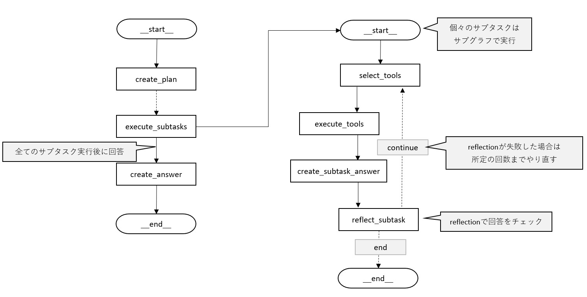

# 概要

ヘルプデスクや RAG の中身における AI エージェントのサンプル開発


# ベースとなっている参考文献

ベースとしているソースコードは下記ですが、ツールを自身で入れ替えたりとコードも一部カスタマイズしてます。

参考文献
[現場で活用するための AI エージェント実践入門]

以下をカスタマイズして開発中
https://github.com/masamasa59/genai-agent-advanced-book

# エージェントワークフロー

参考にしたやつと今は変わりないですが、今後カスタマイズされるかもしれないです。


# セットアップ

こちらセットアップの前提としては、DB（Postgre）がインストールされており、
データがテーブルに格納されていることが前提となります。

## DB セットアップ

Posgre のインストール

```
https://www.postgresql.org/download/windows/
https://qiita.com/tom-sato/items/037b8f8cb4b326710f71
```

以降 Posgre で DB を作成しておく。（CLI でもいいが Pgadmin が楽。）

windows の Posgre に pgvector を入れる方法

```
https://qiita.com/sana_bungal/items/13366afb14ee1ebafff8
```

作成した DB にログインし、PgVector を使えるようにしておく

```
CREATE EXTENSION vector;
```

以下はサンプルのテーブル構成です。

```
- 🗃️ datatable
  - 📄 id (PK)
  - 📄 chunks
  - 📄 embeddings
  - 📄 metadata
```

データ登録用のスクリプトはのちに作成します。
現在は Notion のナレッジが DB に格納されています。

## セットアップ手順

```
uv venv uv-venv
cd ./uv-venv/Scripts
.\activate.ps1 または .\activate
cd ..
cd ..
uv pip install -r requirements.txt
```

# エージェント実行について

ひとまずは「entire_graph_runner.ipynb」を実行すればワークフロー全体を実行可能
